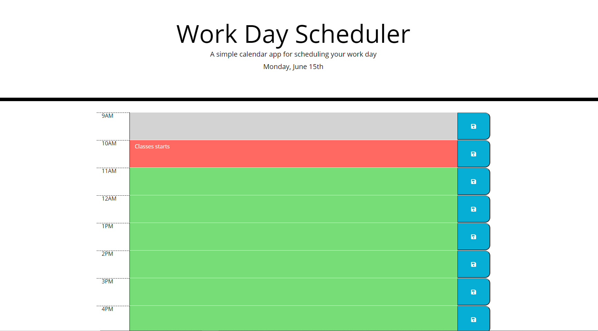

# Hw5-Day-Planner
This homework was to create a dayplanner using the provided html and css page.
A 9-5 schedule was implemented that would display hour blocks that change color depending on the hour

gray is in the past hours
red is current hour
green is future hours

User can type tasks in the blocks and hit save to save the task to local storage.

The moment() was used to get the current day and also g3et the current hour
The time block would have a different color depending on the hour, which was done by using jQuery

github repo: https://github.com/sdratch/Hw5-Day-Planner
deployed site: https://sdratch.github.io/Hw5-Day-Planner/
image: 